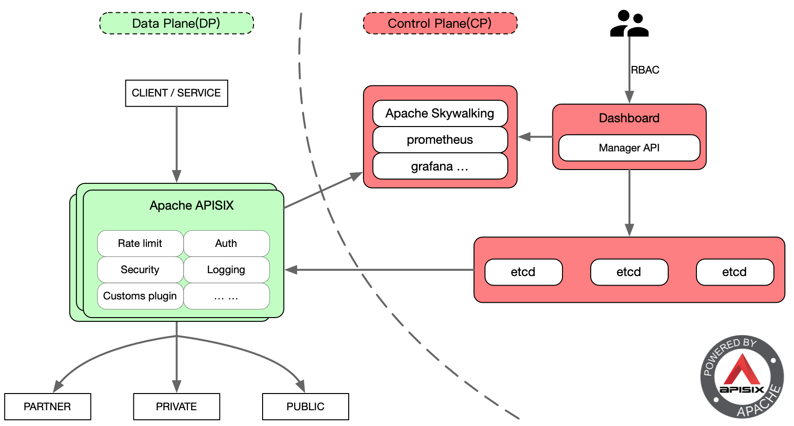

<!--
#
# Licensed to the Apache Software Foundation (ASF) under one or more
# contributor license agreements.  See the NOTICE file distributed with
# this work for additional information regarding copyright ownership.
# The ASF licenses this file to You under the Apache License, Version 2.0
# (the "License"); you may not use this file except in compliance with
# the License.  You may obtain a copy of the License at
#
#     http://www.apache.org/licenses/LICENSE-2.0
#
# Unless required by applicable law or agreed to in writing, software
# distributed under the License is distributed on an "AS IS" BASIS,
# WITHOUT WARRANTIES OR CONDITIONS OF ANY KIND, either express or implied.
# See the License for the specific language governing permissions and
# limitations under the License.
#
-->

# Apache APISIX Dashboard (Experimental)

[](https://github.com/apache/apisix-dashboard/blob/master/LICENSE)

<p align="center">
  <a href="https://apisix.apache.org/">Website</a> •
  <a href="https://github.com/apache/apisix/tree/master/doc">Docs</a> •
  <a href="https://twitter.com/apacheapisix">Twitter</a>
</p>

- The master version should be used with Apache APISIX master version.

- The latest released version is 2.2 and should be used with Apache APISIX 2.1. It is not recommended to use with other Apache APISIX versions.


## What's Apache APISIX Dashboard

The Apache APISIX Dashboard is designed to make it as easy as possible for users to operate [Apache APISIX](https://github.com/apache/apisix) through a frontend interface.

The Dashboard is the control plane and performs all parameter checks; Apache APISIX mixes data and control planes and will evolve to a pure data plane.

This project includes `Manager API`, which will gradually replace `Admin API` in Apache APISIX.

Note: Currently the Dashboard does not have complete coverage of Apache APISIX features, [visit here](https://github.com/apache/apisix-dashboard/milestones) to view the milestones.



## Project structure

```
.
├── CHANGELOG.md
├── CODE_OF_CONDUCT.md
├── CONTRIBUTING.md
├── Dockerfile
├── LICENSE
├── Makefile
├── NOTICE
├── README.md
├── api
├── docs
├── licenses
└── web
```

1. The `api` directory is used to store the `Manager API` source codes, which is used to manage `etcd` and provide APIs to the frontend interface.
2. The `web` directory is used to store the frontend source codes.

## Build then launch

Support the following ways currently.

- [Source Codes](./docs/deploy.md)
- [Docker](./docs/deploy-with-docker.md)

## Development

Please refer to the [Development Guide](./docs/develop.md).

## User Guide

Please refer to the [User Guide](./docs/USER_GUIDE.md).

## Contributing

Please refer to the [Contribution Guide](./CONTRIBUTING.md) for a more detailed information.

## FAQ

Please refer to the [FAQ](./docs/FAQ.md) for more known issues.

## License

[Apache License 2.0](./LICENSE)
