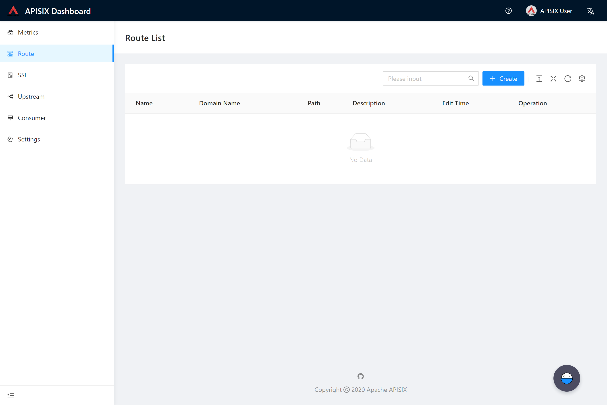
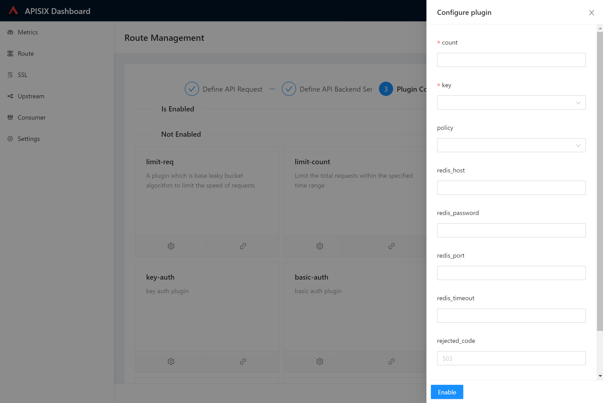
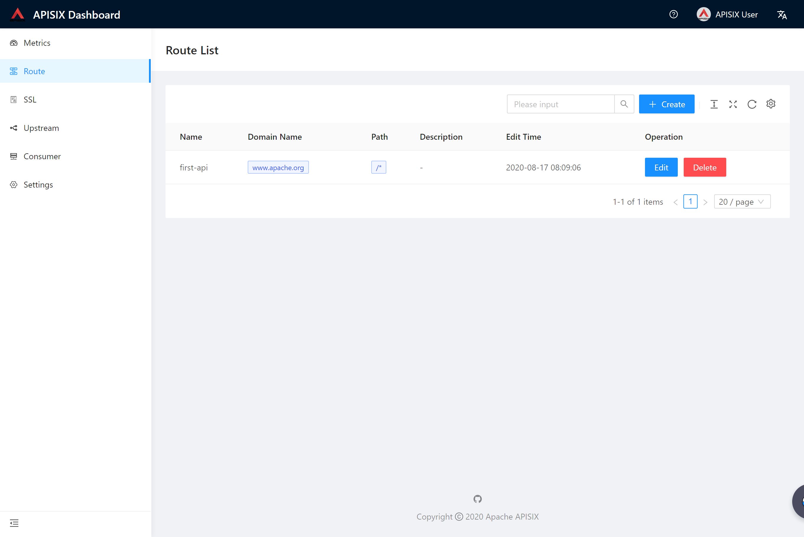

# User Guide

Please visit [http://139.217.190.60/](http://139.217.190.60/) in browser to have a full-preview of the Apache APISIX Dashboard.

The following are parts of the modules' snapshot.

## Metrics

## Route

The Route module aims to control routes by UI instead of calling APIs.

### List

### Create

## Setting

