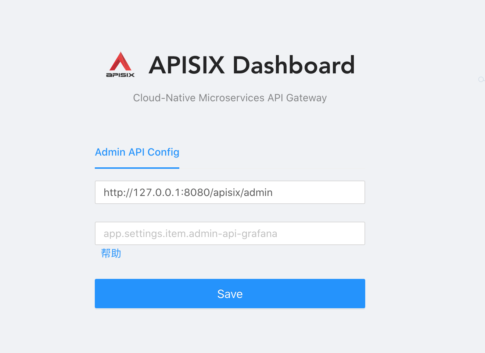
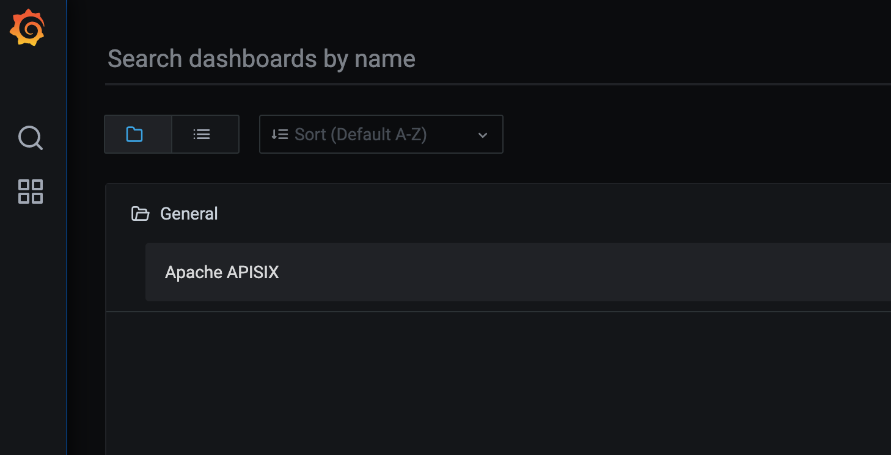
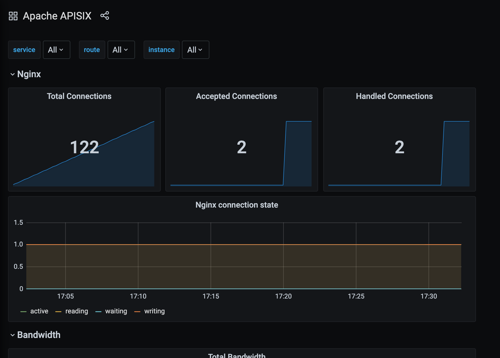
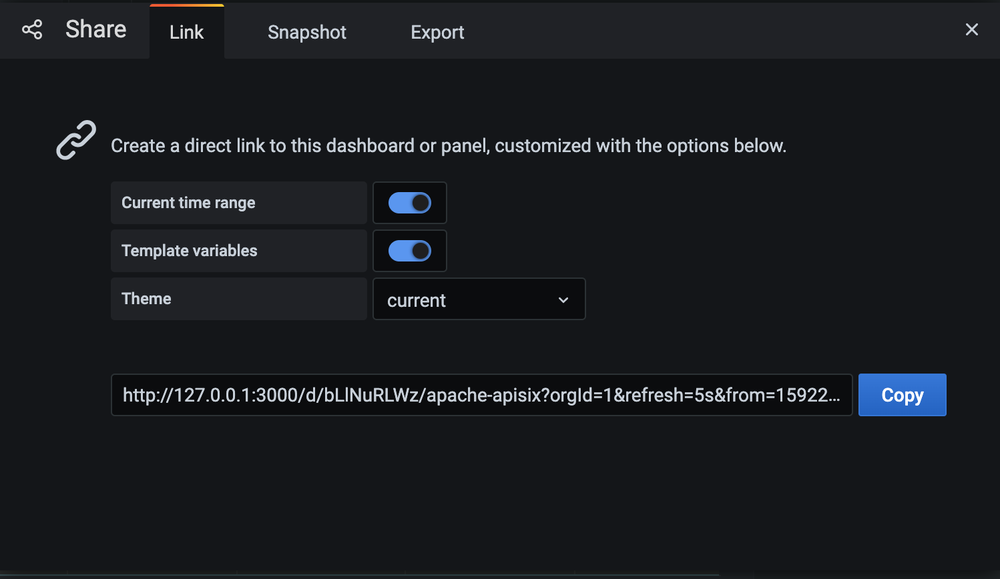
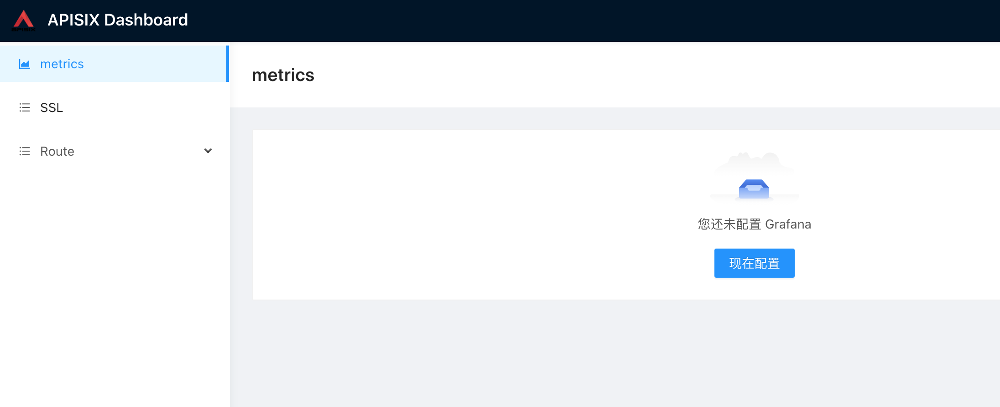
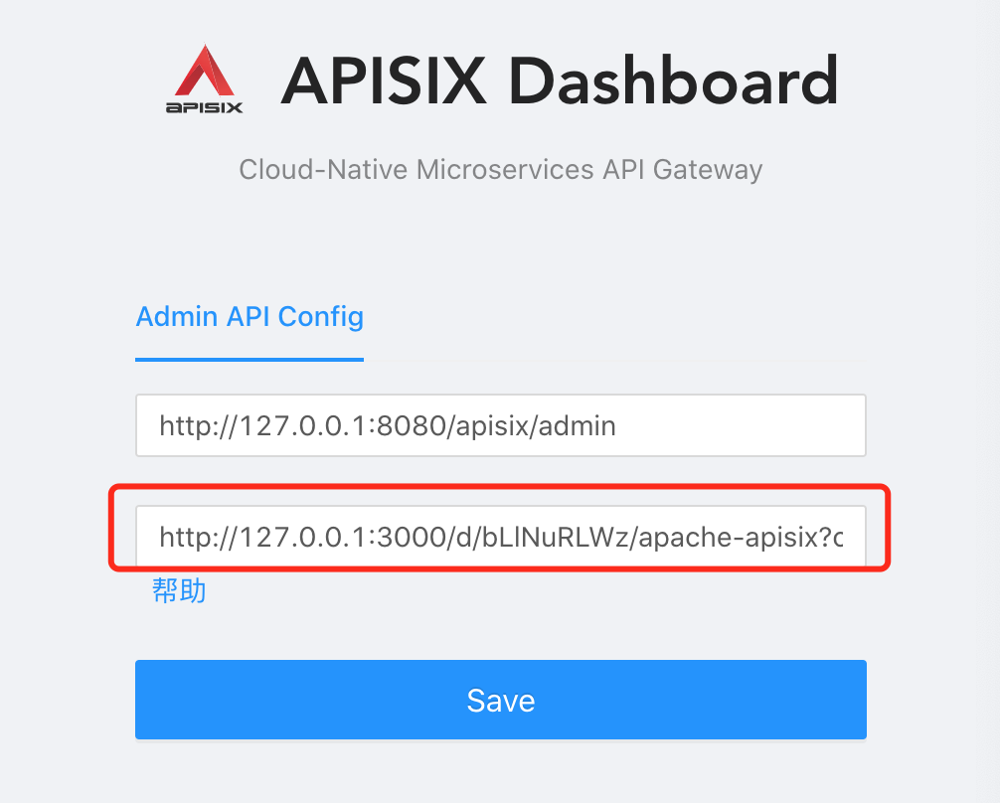
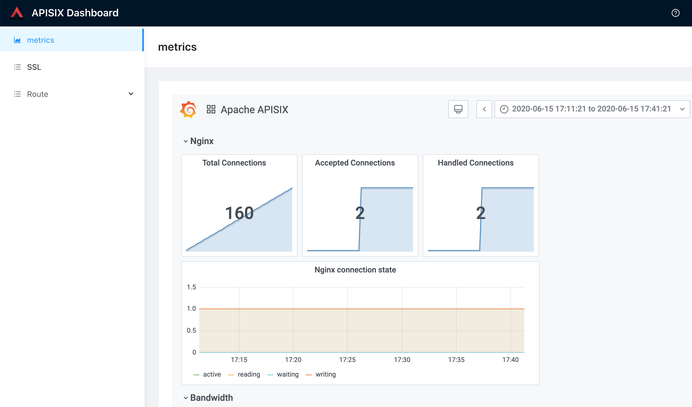

<!--
#
# Licensed to the Apache Software Foundation (ASF) under one or more
# contributor license agreements.  See the NOTICE file distributed with
# this work for additional information regarding copyright ownership.
# The ASF licenses this file to You under the Apache License, Version 2.0
# (the "License"); you may not use this file except in compliance with
# the License.  You may obtain a copy of the License at
#
#     http://www.apache.org/licenses/LICENSE-2.0
#
# Unless required by applicable law or agreed to in writing, software
# distributed under the License is distributed on an "AS IS" BASIS,
# WITHOUT WARRANTIES OR CONDITIONS OF ANY KIND, either express or implied.
# See the License for the specific language governing permissions and
# limitations under the License.
#
-->

## Deploy

```sh
$ cd apisix-dashboard/compose
$ sh gen-config-yaml.sh

# For most users in China, please use some proxy services like https://www.daocloud.io/mirror to speed up your Docker images pulling.
$ docker-compose -p dashboard up -d
```

## Usage

### 1. login dashboard

Visit `http://127.0.0.1/dashboard/` in the browser, Enter `http://127.0.0.1:8080/apisix/admin` into the first input box, this is the backend management service address



now, click `save`.

### 2. If you want to display the grafana metric dashboard, please fill in the grafana shared link as follows

1.get grafana shared link

Visit `http://127.0.0.1:3000/?search=open&orgId=1`



click `Apache APISIX` dashboard, and you can see the page as follow



click the button `shard dashboard` on the right of `Apache APISIX`



copy the link, and then return to dashboard on the step 1



click metric on the left, and then the config button

Paste shared link



save, and you can see the metrics


