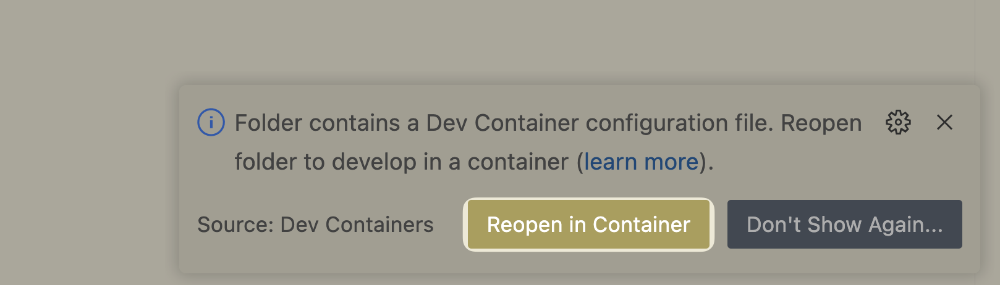
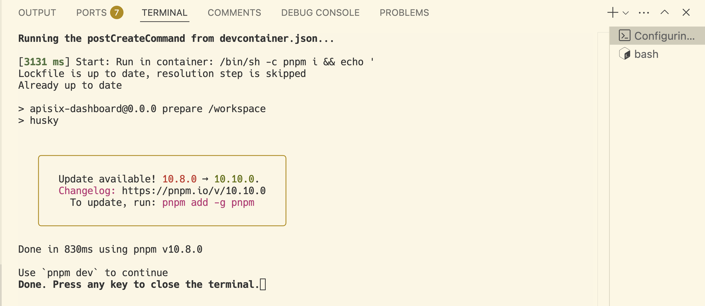

Currently, APISIX Dashboard is a SPA that only supports CSR. For easier development, it is recommended to use `VS Code` and the `Dev Containers` extension. This document uses this approach as an example.

We also welcome contributions to the documentation, including guides for your preferred development workflows.

## Prerequisites

Please install `VS Code` and follow [Developing inside a Container](https://code.visualstudio.com/docs/devcontainers/containers) to set up your environment.

`git`, `node`, `pnpm`, as well as `apisix` and `etcd` are all provided in the `.devcontainer` configuration.

## Clone then open the project

```sh
$ git clone https://github.com/apache/apisix-dashboard.git
$ cd apisix-dashboard
$ code .
```

## Start developing

### 1. Reopen in Container

Generally, after opening the project in `VS Code`, a prompt will appear in the bottom right corner. Please click `Reopen in Container`.



If there is no prompt, open the `Command Palette`, type `reopen`, and select `Dev Containers: Reopen in Container`.


### 2. Wait for the environment to be ready

After clicking, it will take some time for the environment to be built, depending on your network conditions. 

Once the environment is ready, similar information will be displayed in the `TERMINAL` tab.



### 3. Develop

Open a new Terminal and execute:

```sh
pnpm dev
```

You can then modify the code and preview the updated page in the browser in real-time.
