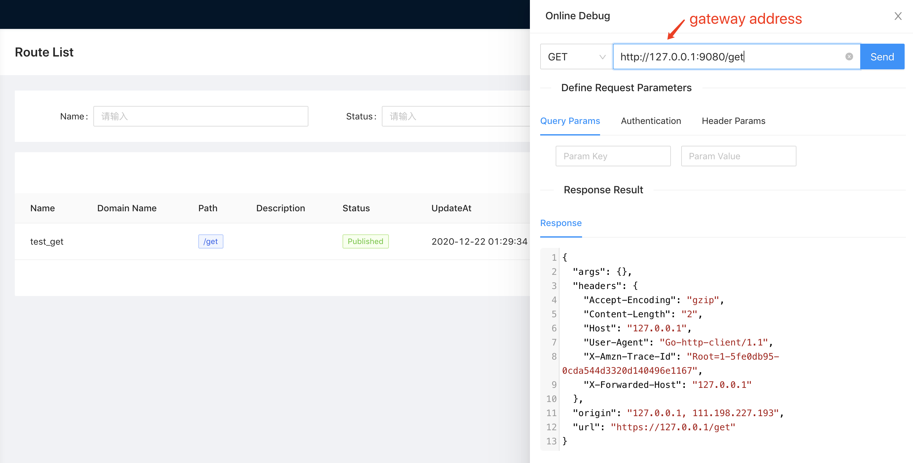
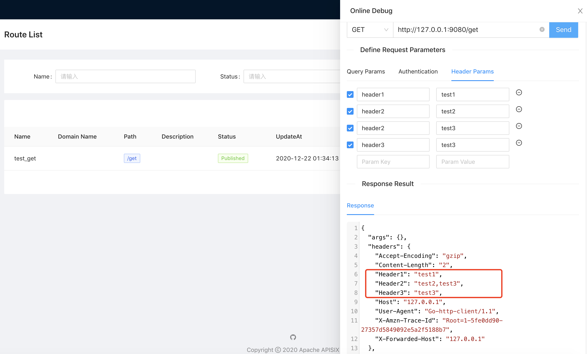
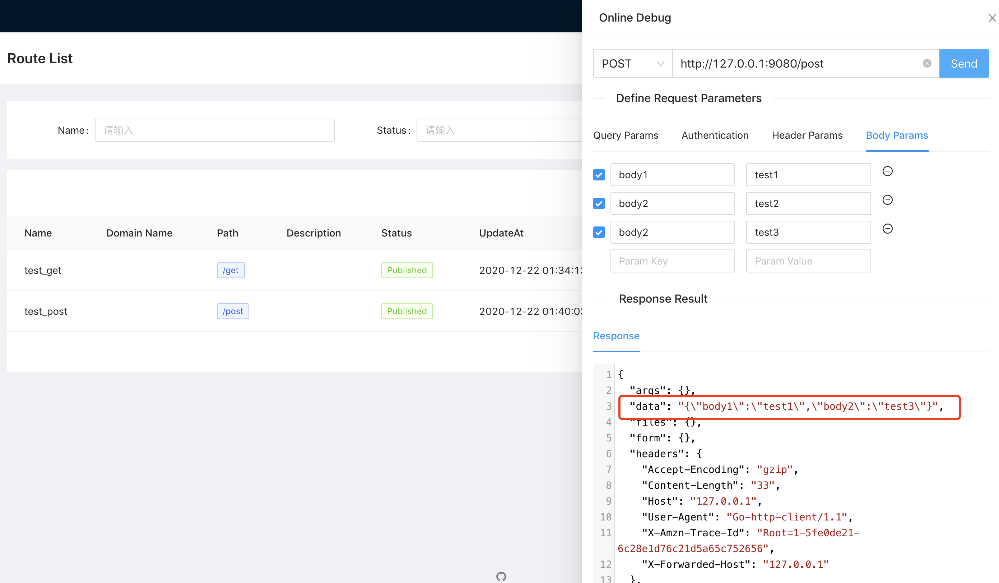
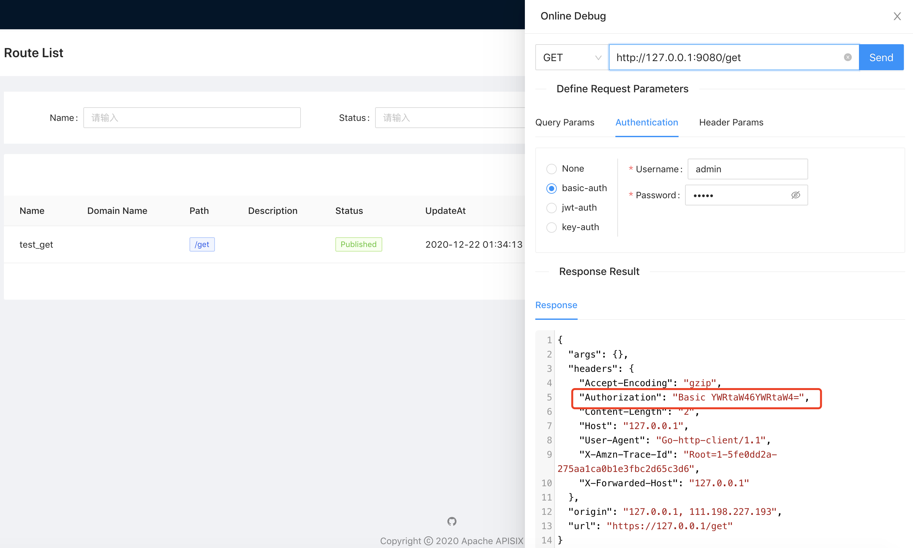

<!--
#
# Licensed to the Apache Software Foundation (ASF) under one or more
# contributor license agreements.  See the NOTICE file distributed with
# this work for additional information regarding copyright ownership.
# The ASF licenses this file to You under the Apache License, Version 2.0
# (the "License"); you may not use this file except in compliance with
# the License.  You may obtain a copy of the License at
#
#     http://www.apache.org/licenses/LICENSE-2.0
#
# Unless required by applicable law or agreed to in writing, software
# distributed under the License is distributed on an "AS IS" BASIS,
# WITHOUT WARRANTIES OR CONDITIONS OF ANY KIND, either express or implied.
# See the License for the specific language governing permissions and
# limitations under the License.
#
-->

The following are parts of the modules' snapshot.

## Dashboard

We support the monitor page by referencing it in [iframe](https://developer.mozilla.org/en-US/docs/Web/HTML/Element/iframe). Before accessing [Grafana](https://grafana.com/), please Enable [`allow_embedding=true`](https://grafana.com/docs/grafana/latest/administration/configuration/#allow_embedding), which defaults to `false`. This causes the browser to fail to render Grafana pages properly due to security policies.

## Route

The Route module aims to control routes by UI instead of calling APIs.

### List

### Create

### Online debug

We can debug a route both published or offline with the online debug function, which is located in the routes list page.

1. Debug a published route

2. Debug a offline route

3. Debug a published route with query params

4. Debug a published route with header params

5. Debug a published route with body params

6. Debug a published route with basic auth

## Setting

