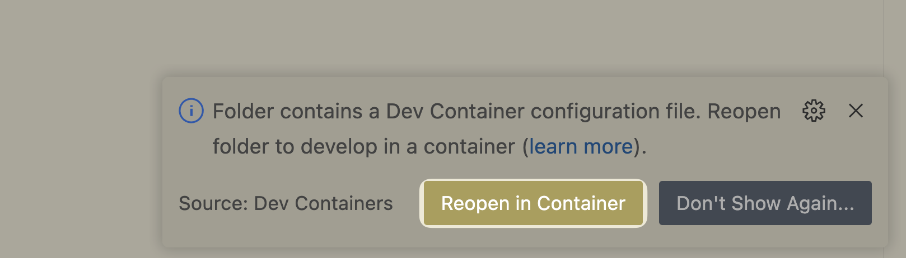

目前 APISIX Dashboard 是一个仅支持 CSR SPA 的前端项目，为了便于开发，推荐使用 `VS Code` 和 `Dev Containers` 插件，本文档也以此为例。

同时也欢迎贡献文档，提供你喜欢的其他开发方式。

## Prerequisites

请安装 `VS Code`, 并参考 [Developing inside a Container](https://code.visualstudio.com/docs/devcontainers/containers) 准备环境。

## Clone then open the project

```sh
$ git clone https://github.com/apache/apisix-dashboard.git
$ cd apisix-dashboard
$ code .
```

## Start developing

一般来说，`VS Code` 会在打开项目后，在 *右下角* 弹出提示框，请点击 `Reopen in Container`



如果没有提示框，请打开 `Command Palette`，并输入 `reopen`，选择 `Dev Containers: Reopen in Container`。


