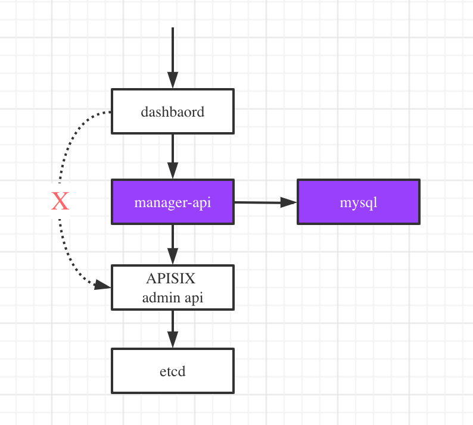

<!--
#
# Licensed to the Apache Software Foundation (ASF) under one or more
# contributor license agreements.  See the NOTICE file distributed with
# this work for additional information regarding copyright ownership.
# The ASF licenses this file to You under the Apache License, Version 2.0
# (the "License"); you may not use this file except in compliance with
# the License.  You may obtain a copy of the License at
#
#     http://www.apache.org/licenses/LICENSE-2.0
#
# Unless required by applicable law or agreed to in writing, software
# distributed under the License is distributed on an "AS IS" BASIS,
# WITHOUT WARRANTIES OR CONDITIONS OF ANY KIND, either express or implied.
# See the License for the specific language governing permissions and
# limitations under the License.
#
-->

# Apache APISIX Dashboard

## the relation between dashboard and manager-api

At present, the dashboard is divided into two parts, one is the front-end page and script, and the other is the manager that takes over the front-end api interface.

Compared with the previous apisix-dashboard, we have one more manager module, which is used to encapsulate the apisix admin api, which is more suitable for page element display.

The module call relationship is as follows

The manager-api has its own storage. The currently used mysql, mysql stores some management information other than APISIX internal objects.

When deploying dashboard, we are divided into 3 modules, namely dashboard page, manager-api, and the mysql database that manager-api depends on. The purple part in the figure is the two new modules added this time.

You can also use docker-compose for one-click deployment, refer to [here](./compose/README.md)
